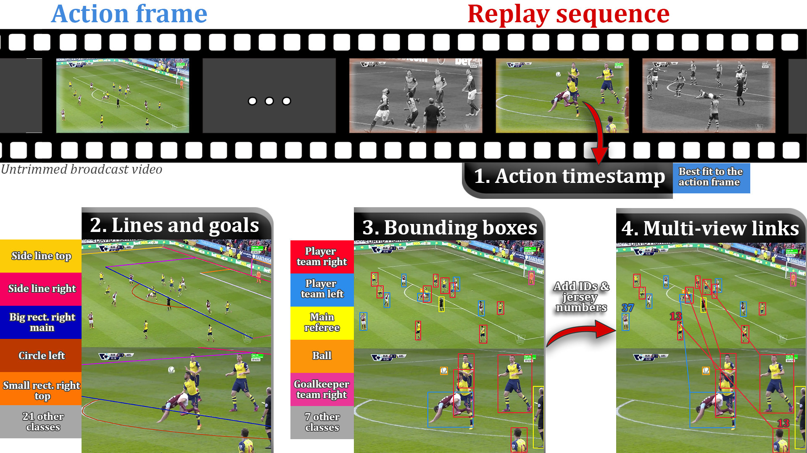

# SoccerNetv3

This repository contains a generic dataloader for the SoccerNet-v3 annotations and data. It allows to load the images in any chosen resolution, and parses the json annotation files to retrieve the bounding boxes, lines and correspondences between bounding boxes in a ready-to-use format. This repository also provides a tool to visualize the annotations on the images and a function to produce the statistics of the annotations as described in the paper.

<p align="center"></p>

In each replay sequence of an action within the 500 SoccerNet's full broadcast games, we timestamp the replay frame showing the live action frame. Then, we annotate the lines and goals on all those replay and action frames. We further frame each human on the field within a bounding box, we specify players team, and annotate salient objects. Finally, we establish player correspondences across replay and live views of a same action, where jersey numbers serve as identifiers whenever possible. SoccerNet-v3 provides a rich environment to tackle soccer-related computer vision tasks.

## Create Conda environement

To use the dataloader or the other tools, create an environment containing the following requirements:

```bash
conda create -n SoccerNetv3
conda activate SoccerNetv3
conda install pytorch torchvision -c pytorch
pip install tqdm opencv-python
```

## Download Data

In order to load the data, containing the annotations as json files and the images in zipped folders, first install the SoccerNet package:

```bash
pip install SoccerNet
```

Then run the following Python functions, replacing <code>path/to/SoccerNet</code> with the folder where you want to save the data. Note that the frames requires around 60GB of local storage and the labels around 1GB.

```python
from SoccerNet.Downloader import SoccerNetDownloader
mySoccerNetDownloader = SoccerNetDownloader(LocalDirectory="path/to/SoccerNet")
mySoccerNetDownloader.password = "SoccerNet_Reviewers_SDATA"
mySoccerNetDownloader.downloadGames(files=["Labels-v3.json", "Frames-v3.zip"], split=["train","valid","test"], task="frames") # download frames and labels for the 400 games of SN v3 - Requires around 60 GB of local storage
```

This will download the data in the SoccerNet format in <code>path/to/SoccerNet</code>:
- One folder per championship (england_epl, france_ligue-1,...).
- In each of the above folders, one folder per season (2014-2015,2015-2016,...).
- In each of the above folders, one folder per game (2015-02-21 - 18-00 Chelsea 1 - 1 Burnley,...).
- In each of the above folders, a zipped folder containing all action and replay images for that game, named <code>%d.png</code> for the actions and <code>%d_%d.png</code> for the replays (e.g. the action 7.png is linked to the replay images 7_1.png, 7_2.png, etc), and a <code>Labels-v3.json</code> file containing the annotations for each image of the game.

## Dataloader

This repository provides a generic dataloader in PyTorch. The data is loaded as follows: 
- Each item is a list of dictionaries related to an action. 
- The first dictionary of the list is related to the action frame, and the remaining elements are related to the replays of this action.
- Each dictionary is composed of 4 important keys:
1. "image": containing the image loaded in the PyTorch data format (torch.FloatTensor),
2. "bboxes": containing the bounding boxes of the image in a Tensor of size (num_bboxes,6), where the second dimension is (x_top, y_top, width, height, class_index, jersey_number),
3. "lines": containing a list of elements, one per line. Each element is a list of 2 items: the first one is a Tensor of points with variable size (x1,y1,x2,y2,...,xn,yn), and the second one is the class index of the line.
4. "links: containing the correspondences between the bounding boxes in a Tensor of size (num_correspondences, 4), with the second dimension being (index of the first image, index of the bounding box in the first image, index of the second image, index of the bounding box in the second image).

We provide two modes for loading the images, either preloading them in the RAM before loading any batch, or loading them on the fly at each batch. The first solution is faster in the case of multiple passes through the dataset, but requires a large amount of RAM, while the second is cheaper in terms of RAM but requires read operations on the disk at each batch.

`python dataloader.py --SoccerNet_path path/to/SoccerNet --zipped_images`

options:
- `--preload_images`: preload the images in memory at construction time
- `--zipped_images`: read the images directly from the zipped file	
- `--split`:  Select the split of dataset to load (e.g., "train", "valid", "test")
- `--tiny`: Select a smaller number of games in the above set.
- `--num_workers`: number of workers for the batch loading, larger numbers mean faster loading if the computer ressources are sufficient
- `--resolution_width`: width resolution of the images to load
- `--resolution_height`: height resolution of the images to load

## Visualization

This repository provides a tool to visualize the annotations on the images. The arguments are similar to the dataloader, except a new `--save_path` which has to be specified to save the images in a chosen folder.

`python visualization.py --SoccerNet_path path/to/SoccerNet --save_path path/to/saving/folder --zipped_images`

Several images are created in the saving folder: the original image for each action and replays, the same images with all bounding boxes, lines and a summary image of the correspondences between the bounding boxes.

<p align="center"></p>

## Statistics

This repository finally provides the function used to produce the statistics presented in the paper. The arguments are similar to the visualization tool;

`python statistics.py --SoccerNet_path path/to/SoccerNet --save_path path/to/saving/folder --zipped_images`

The statistics are saved in a json file in the saving folder.


## Authors

* **Anthony Cioppa**, University of Liège (ULiège).
* **Adrien Deliège**, University of Liège (ULiège).
* **Silvio Giancola**, King Abdullah University of Science and Technology (KAUST).

See the [AUTHORS](AUTHORS) file for details.


## License

See the [LICENSE](LICENSE) file for details.

## Acknowledgments

* Anthony Cioppa is funded by the FRIA, Belgium.
* This work is supported by the DeepSport and TRAIL projects of the Walloon Region, at the University of Liège (ULiège), Belgium.
* This work was supported by the Service Public de Wallonie (SPW) Recherche under the DeepSport project and Grant No.326
2010235 (ARIAC by https://DigitalWallonia4.ai)
* This work is also supported by the King Abdullah University of Science and Technology (KAUST) Office of Sponsored Research (OSR) (award327
OSR-CRG2017-3405).
